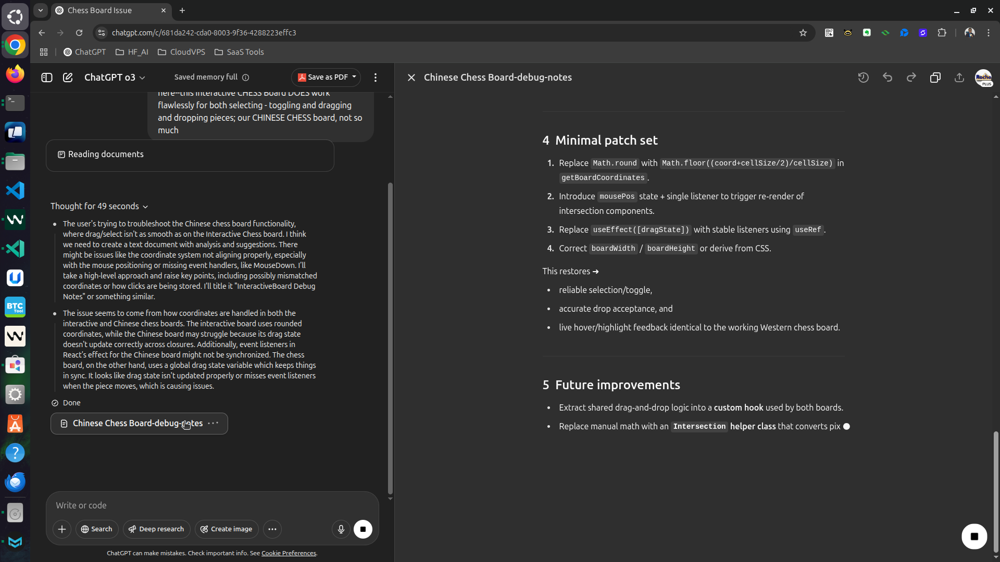

# Debugging the Xiang Qi (Chinese Chess) InteractiveBoard

---

## 1  Problem statement

* **Observed:** The Western chess board (`InteractiveChessBored.websim.js`) supports **click‑to‑select/toggle** and **drag‑and‑drop** flawlessly.
* **Observed:** The Xiang Qi board (`InteractiveBoard.tsx`) sometimes fails to

  * register clicks/selection,
  * recognise a legal drop location, or
  * update hover/valid‑move markers while dragging.

---

## 2  Key architectural differences

| Concern                             | Western chess (works)                                                                  | Xiang Qi (broken)                                                                                                                                                                   |
| ----------------------------------- | -------------------------------------------------------------------------------------- | ------------------------------------------------------------------------------------------------------------------------------------------------------------------------------------ |
| **State holder for dragging** | *Module‑scoped* mutable `dragState` object shared by all handlers                 | React**state** (`dragState`) updated via `setDragState`, plus a `useEffect` that (re‑)binds listeners on every change                                                   |
| **Board geometry**            | Pieces live**inside squares** → click coordinate is the square’s bounding‑box | Pieces live**on intersections** → click coordinate must snap **to grid lines**, not squares                                                                             |
| **Hover / drop feedback**     | Squares re‑evaluate every `mousemove` because DOM classes are manipulated directly  | React components compute `isPotentialDropPosition` **once per render**, using `document.documentElement.dataset` to read the last mouse position (a mutable side‑channel) |

---

## 3  Root causes

1. **Coordinate rounding off‑by‑½ cell**
   `getBoardCoordinates` uses `Math.round()`; for a piece centred at *exactly* an intersection, moving the cursor only ¼ cell can flip the rounded value, producing an off‑by‑one row/col that is *not* in `validMoves` ⟶ drop rejected.

   ```ts
   // ❌ current
   const col = Math.round(relativeX / cellSize);
   const row = Math.round(relativeY / cellSize);
   // ✔ fix
   const col = Math.floor((relativeX + cellSize/2) / cellSize);
   const row = Math.floor((relativeY + cellSize/2) / cellSize);
   ```
2. **Stale hover / drop indicators**
   ‑ Intersections compute `isPotentialDropPosition` by reading `data-mouse‑x/y` that is mutated by a global `mousemove` listener. Because no React state changes, **components never re‑render**, so the green/red circles don’t follow the cursor.

   **Fix:** Lift `mousePos` into React state **or** use `useRef` + explicit `forceUpdate` on drag. Easiest patch:

   ```ts
   const [mousePos,setMousePos] = useState<{x:number,y:number}|null>(null);
   useEffect(()=>{
     const h = (e:MouseEvent)=> setMousePos({x:e.clientX,y:e.clientY});
     document.addEventListener('mousemove',h);
     return ()=> document.removeEventListener('mousemove',h);
   },[]);
   // …then use mousePos instead of data‑attrs
   ```
3. **Listener rebinding churn**
   `useEffect` that attaches `mousemove`/`mouseup` depends on `dragState`. Every state change tears down and re‑adds listeners, occasionally dropping events on fast drags.
   **Fix:** Attach listeners **once** (empty dependency array) and read mutable refs:

   ```ts
   const dragRef = useRef<DragState>({...});
   useEffect(()=>{ dragRef.current = dragState; }, [dragState]);
   useEffect(()=>{
     const onMove = (e:MouseEvent)=>{ /* use dragRef.current */ };
     document.addEventListener('mousemove',onMove);
     return ()=> document.removeEventListener('mousemove',onMove);
   },[]);
   ```
4. **Board overlay sizing**
   `boardWidth = cellSize*8` (“8 spaces between 9 intersections”). But the absolute‑positioned grid & pieces are laid out assuming **9×cellSize** width. When the drag image strays into the rightmost cell, `getBoardCoordinates` clamps the value and the drop is rejected.

   > **Fix:** `const boardWidth = cellSize * 8;` ➜ **`cellSize * 8 + 1`** (include the last line) *or* simpler: compute from container `offsetWidth`.
   >

---

## 4  Minimal patch set

1. Replace `Math.round` with `Math.floor((coord+cellSize/2)/cellSize)` in `getBoardCoordinates`.
2. Introduce `mousePos` state + single listener to trigger re‑render of intersection components.
3. Replace `useEffect([dragState])` with stable listeners using `useRef`.
4. Correct `boardWidth` / `boardHeight` or derive from CSS.

This restores ➜

* reliable selection/toggle,
* accurate drop acceptance, and
* live hover/highlight feedback identical to the working Western chess board.

---

## 5  Future improvements

* Extract shared drag‑and‑drop logic into a **custom hook** used by both boards.
* Replace manual math with an **`Intersection` helper class** that converts pixels ⇆ grid.
* Add **unit tests** for `getValidMoves` and coordinate mapping (e.g. Jest + RTL‑`fireEvent.mouseMove`).
* Consider debouncing `mousePos` updates (`requestAnimationFrame`) to avoid excess renders.

---

*Compiled 9 May 2025 — o3 ChatGPT debug session*
