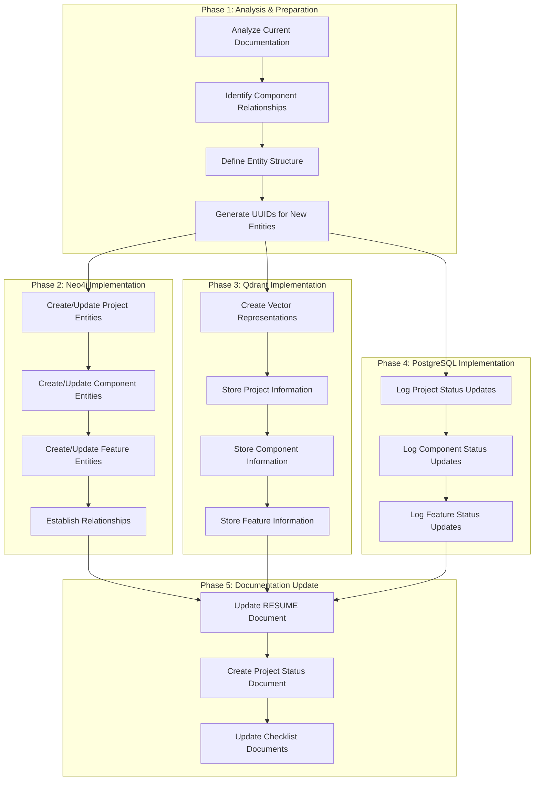

# Plan for Updating the General Xiang Hybrid Knowledge Graph and Documentation

*Date: April 30, 2025*

## Overview

This document outlines the comprehensive plan for updating the hybrid Knowledge Graph (hKG) and in-site documentation for the General Xiang project. The plan focuses on creating a complete representation of the project's current state across all three databases (neo4j, qdrant, postgres) with proper relationships between components, ensuring each entry shares a common UUID.

## Overview Diagram



## Phase 1: Analysis & Preparation

### Task 1.1: Analyze Current Documentation
- Review all checklist documents to identify completed, in-progress, and not-started items
- Analyze architecture documents to understand component relationships
- Review the current state of the hKG to identify gaps and inconsistencies

### Task 1.2: Identify Component Relationships
- Map relationships between project components, features, and systems
- Identify dependencies between components
- Document the hierarchical structure of the project

### Task 1.3: Define Entity Structure
- Define the structure for each entity type (Project, Component, Feature, etc.)
- Ensure consistency across all three databases
- Define common metadata fields for all entities

### Task 1.4: Generate UUIDs for New Entities
- Generate UUIDs for all new entities to be added to the hKG
- Maintain a mapping of entity names to UUIDs for reference
- Ensure existing entities maintain their current UUIDs

## Phase 2: Neo4j Implementation

### Task 2.1: Create/Update Project Entities
- Create/update the main "General Xiang" project entity
- Include comprehensive observations about the project status
- Ensure proper entity type and UUID assignment

### Task 2.2: Create/Update Component Entities
- Create/update entities for all major components:
  - Board Implementation
  - UI Components
  - Project Organization
  - Tutorial System
  - Multiplayer Features
  - Game Mechanics
  - PWA & Mobile
  - Subscription and Payment Integration
  - Teaching Module
  - UI Refinement and User Experience
  - Testing and Quality Assurance
  - Deployment and Distribution

### Task 2.3: Create/Update Feature Entities
- Create/update entities for specific features within each component
- Include detailed observations about implementation status
- Assign appropriate entity types and UUIDs

### Task 2.4: Establish Relationships
- Create relationships between entities to represent dependencies and hierarchies
- Ensure bidirectional relationships where appropriate
- Use consistent relationship types across the knowledge graph

## Phase 3: Qdrant Implementation

### Task 3.1: Create Vector Representations
- Generate vector representations for all entities
- Ensure vector representations capture the semantic meaning of entities
- Maintain consistency with Neo4j entities

### Task 3.2: Store Project Information
- Store the main project information in Qdrant
- Include the same UUID as used in Neo4j
- Add appropriate metadata for search and retrieval

### Task 3.3: Store Component Information
- Store information about all major components
- Maintain consistent UUIDs with Neo4j entities
- Include detailed metadata for each component

### Task 3.4: Store Feature Information
- Store information about specific features
- Ensure UUIDs match Neo4j entities
- Include comprehensive metadata for search and retrieval

## Phase 4: PostgreSQL Implementation

### Task 4.1: Log Project Status Updates
- Create audit logs for project status updates
- Include timestamps, user information, and action details
- Reference the same UUIDs used in Neo4j and Qdrant

### Task 4.2: Log Component Status Updates
- Create audit logs for component status updates
- Include detailed information about changes to component status
- Maintain UUID consistency with other databases

### Task 4.3: Log Feature Status Updates
- Create audit logs for feature status updates
- Document the progression of feature implementation
- Ensure UUID consistency across all three databases

## Phase 5: Documentation Update

### Task 5.1: Update RESUME Document
- Update the RESUME-GeneralXiang document to reflect the current project status
- Ensure consistency with the hKG
- Include references to the latest checklist information

### Task 5.2: Create Project Status Document
- Create a comprehensive project status document
- Include detailed information about all components and features
- Reference the hKG entities for traceability

### Task 5.3: Update Checklist Documents
- Update all checklist documents to reflect the current project status
- Ensure consistency with the hKG
- Include timestamps and version information

## Implementation Details

### Entity Structure
Each entity in the hKG will have the following structure:

```json
{
  "entityID": "UUID",
  "name": "Entity Name",
  "entityType": "Project|Component|Feature|Document|...",
  "observations": [
    "Detailed observation 1",
    "Detailed observation 2",
    "..."
  ],
  "status": "Completed|In Progress|Not Started",
  "completionPercentage": 0-100,
  "lastUpdated": "ISO timestamp"
}
```

### Relationship Structure
Relationships between entities will follow this structure:

```json
{
  "from": "Source Entity UUID",
  "to": "Target Entity UUID",
  "relationType": "contains|depends_on|implements|...",
  "properties": {
    "property1": "value1",
    "property2": "value2",
    "..."
  }
}
```

### MCP Server Utilization

#### Neo4j Server
- `create_entities`: Create new entities for projects, components, and features
- `create_relations`: Establish relationships between entities
- `add_observations`: Add detailed observations to existing entities
- `delete_entities`: Remove obsolete entities if necessary
- `search_nodes`: Query the knowledge graph for specific information

#### Qdrant Server
- `qdrant-store`: Store vector representations of entities
- `qdrant-find`: Query for semantically similar entities

#### PostgreSQL Server
- `log_audit_entry`: Log all updates to the hKG
- `query_audit_logs`: Retrieve historical information about entity updates

## Verification and Validation

To ensure the integrity and consistency of the hKG update, the following verification steps will be performed:

1. **UUID Consistency Check**: Verify that all entities maintain the same UUID across all three databases
2. **Relationship Validation**: Ensure all relationships are properly established and bidirectional where appropriate
3. **Documentation Consistency**: Verify that all documentation accurately reflects the state of the hKG
4. **Status Accuracy**: Confirm that the status of all components and features accurately reflects the current project state

## Next Steps

After the hKG update is complete, the following next steps are recommended:

1. Implement a regular update schedule for the hKG to maintain consistency with the project status
2. Develop automated tools to synchronize documentation with the hKG
3. Create visualization tools to represent the project status based on the hKG data