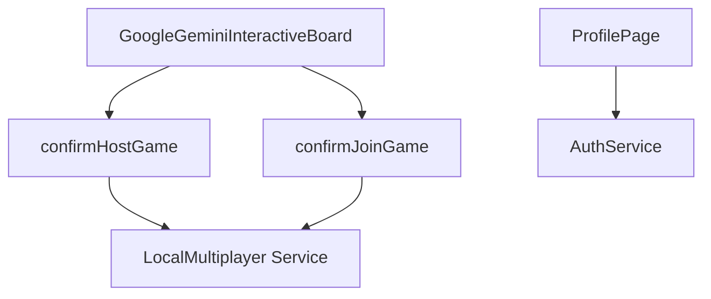

# Host/Join Implementation Snapshot - After Update (02 Jul 2025)

This document reflects the architecture after introducing local multiplayer functionality and improved sign‑in handling.

* `confirmHostGame` now calls `LocalMultiplayer.hostGame` and begins listening for join requests.
* `confirmJoinGame` uses `LocalMultiplayer.joinGame` to connect with the host.
* The profile page redirects to the home screen after a short delay when the user is not signed in.
