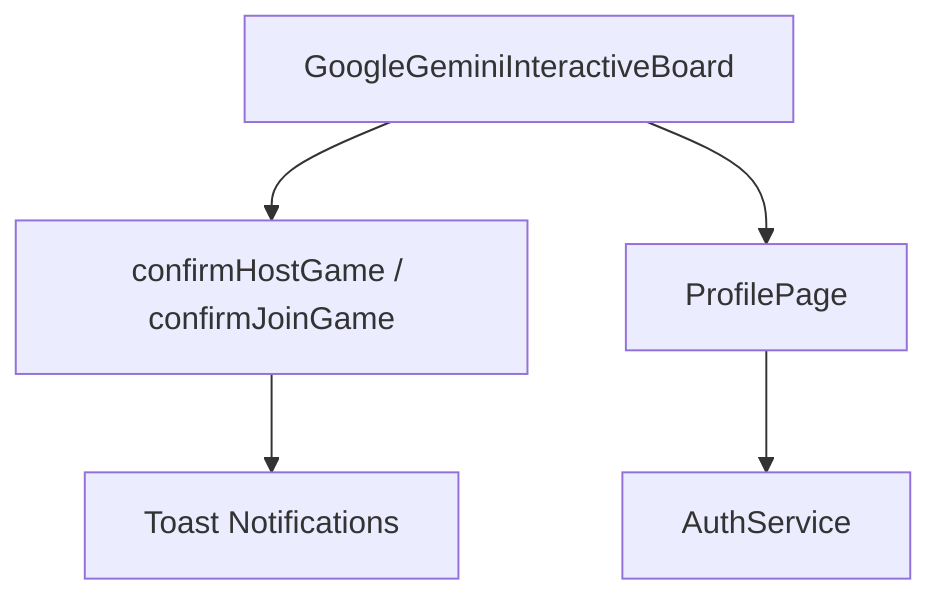

# Host/Join Implementation Snapshot - Before Update (02 Jul 2025)

This snapshot documents the relevant pieces of the project prior to adding real host and join game logic.

* `confirmHostGame` and `confirmJoinGame` only displayed toasts and did not establish any connection.
* `/profile` showed **"Please sign in first."** with no navigation back when unauthenticated.
