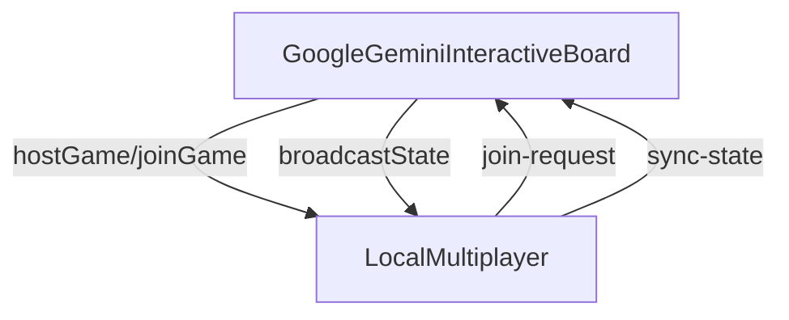

# Local Multiplayer Sync Snapshot - After This Session (02 Jul 2025)

After the update, board state changes are shared across browser tabs.

* `broadcastState` sends the entire `GameState` via `LocalMultiplayer`.
* When a join request arrives, the host immediately broadcasts the current state.
* Both host and joiner apply incoming `sync-state` messages to stay in sync.
