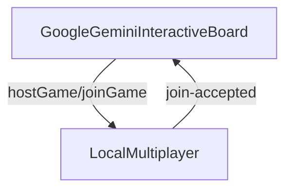

# Local Multiplayer Sync Snapshot - Before This Session (02 Jul 2025)

This diagram captures the state prior to enabling board state synchronization over `LocalMultiplayer`.

* Moves made on the board were **not** broadcast to other tabs.
* Opponents could connect but would not see each other's moves.
