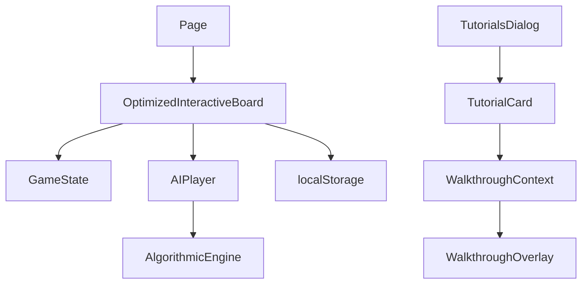

# General Xiang - Save/Load and AI Tutorial Update (Post-Update Snapshot)

*Date: 2025-07-02*

This document reflects the architecture after implementing save/load validation, integrated AI opponent, and tutorial mini-challenges.

## Updated Modules
- `src/game/gameState.ts` now exports `isValidGameState` for validating persisted data.
- `src/components/OptimizedInteractiveBoard.tsx` manages an `AIPlayer`, exposes `startAIGame` and `startMiniChallenge`, and triggers AI moves automatically.
- `src/contexts/WalkthroughContext.tsx` accepts an `onComplete` callback.
- `src/components/TutorialCard.tsx` triggers mini-challenges via the walkthrough completion callback.
- `src/app/page.tsx` provides a sidebar option to start an AI game and connects tutorial cards to board challenges.

## Module Relationships

