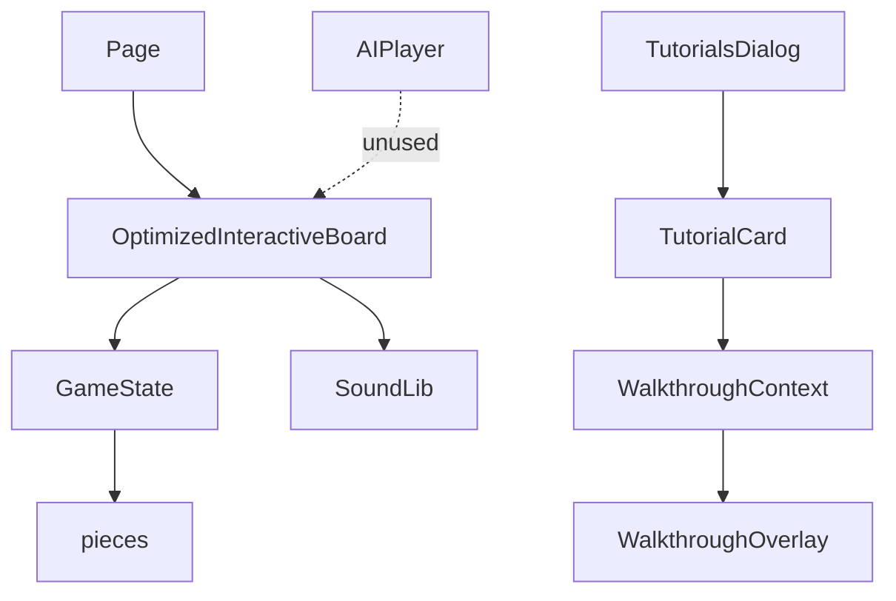

# General Xiang - Save/Load and AI Tutorial Update (Pre-Update Snapshot)

*Date: 2025-07-02*

This document captures the structure of the project before activating the AI opponent and mini-challenge tutorials. The AI engine exists but is not connected to the board. Save functionality stores the game state in local storage without validation, and load functionality is incomplete.

## Key Modules
- `src/app/page.tsx` – main application page rendering `OptimizedInteractiveBoard` and various dialogs.
- `src/components/OptimizedInteractiveBoard.tsx` – primary board component with drag-and-drop piece logic and basic save/load stubs.
- `src/game/gameState.ts` – game state utilities.
- `src/ai/AIPlayer.ts` and `src/ai/engine/*` – algorithmic AI implementation (unused).
- `src/contexts/WalkthroughContext.tsx` & `src/components/WalkthroughOverlay.tsx` – tutorial walkthrough system.

## Current Relationships

AI components are present but not wired to gameplay or tutorials.
