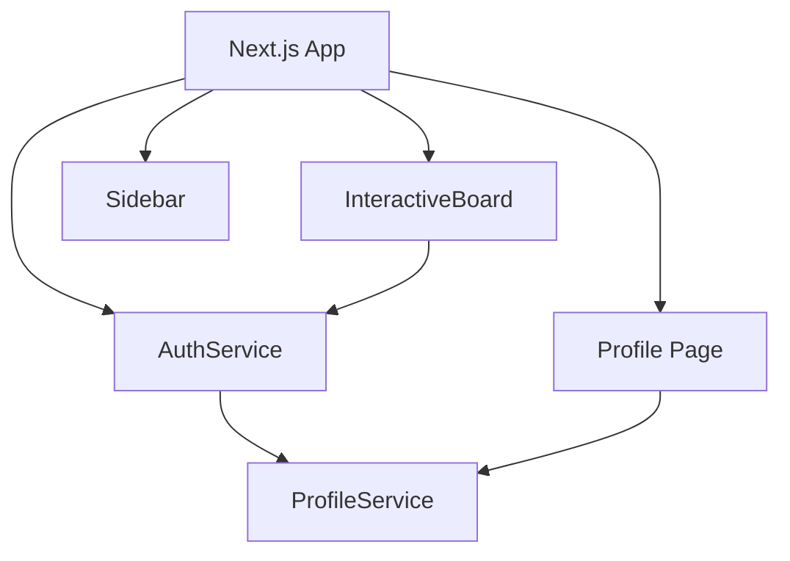

# User Accounts & Profiles Architecture (After Update)

The application now persists user profiles using localStorage and exposes a profile editing page.

* `ProfileService` stores `UserProfile` objects using the browser's localStorage.
* `/profile` allows users to view and update their profile.
* The sidebar links to the profile page.
