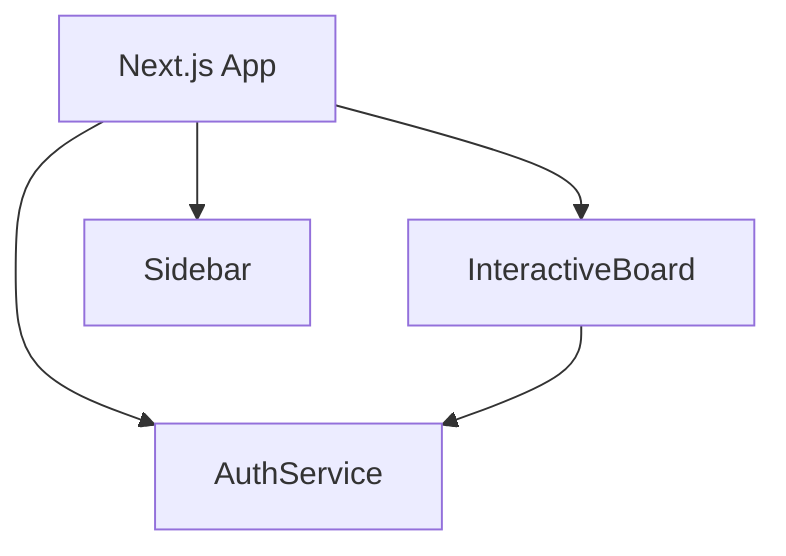

# User Accounts & Profiles Architecture (Before Update)

This document captures the relevant portions of the codebase prior to adding persistent user accounts and profile management.

* Authentication is handled by `AuthService` with temporary in-memory users.
* There is no dedicated profile storage service.
* The UI provides a `LoginDialog` but it is not wired into the sidebar.
