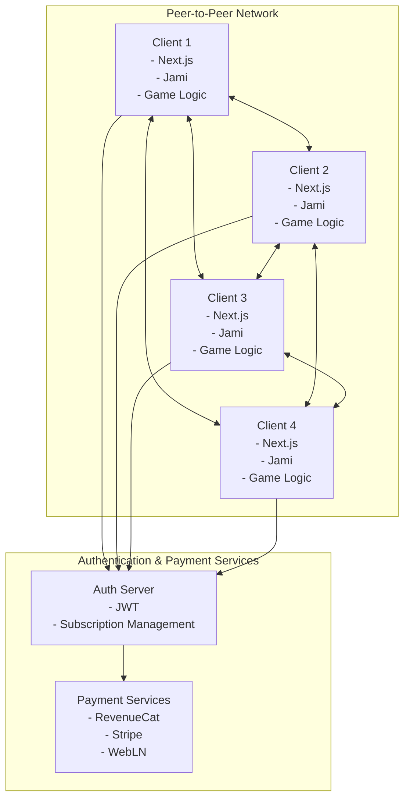

# Xiangqi Master Architecture

This document outlines the architecture for the Xiangqi Master game, focusing on creating a system that works with both AI and human players using the same connection interfaces, based on the MahCheungg architecture.

## System Overview

Xiangqi Master is a digital implementation of traditional Chinese Chess with multiple subscription tiers:
- **Free Trial/Teaching Mode**: Limited functionality focused on learning
- **Standard Tier**: Local LAN play with AI and human players
- **Premium Tier**: Online matchmaking with similarly skilled players

## Core Components

### 1. Player Interface

The central architectural concept is a unified player interface that both human and AI players implement:

```typescript
interface Player {
  // Basic properties
  id: string;
  name: string;
  isAI: boolean;

  // Game state
  pieces: Piece[];
  capturedPieces: Piece[];
  
  // Actions
  movePiece(piece: Piece, position: Position): boolean;
  capturePiece(piece: Piece): void;
  
  // Decision making
  getMoveDecision(): Promise<Move>;
  
  // Communication
  sendMessage(message: string): void;
  receiveMessage(message: string, sender: Player): void;
  
  // Connection management
  connect(): Promise<boolean>;
  disconnect(): void;
  isConnected(): boolean;
}
```

This interface ensures that the game logic doesn't need to know whether it's interacting with a human or AI player.

### 2. Game Logic

The game logic manages:
- Game rules and validation
- Turn management
- Piece movement and capture
- Check and checkmate detection
- Game state tracking
- Scoring and game history

### 3. Networking Layer

The networking layer leverages Jami for all communication needs:
- Jami multicast messaging for game state transport and synchronization
- Peer-to-peer connections eliminating the need for a central server
- LAN discovery for local play
- Embedded game state updates within conversation messages
- Resilient architecture with timeout fallbacks for disconnected players
- Conflict resolution using timestamps for game state synchronization

### 4. Subscription System

The subscription system manages:
- User authentication
- Subscription tier management via RevenueCat
- Feature gating based on subscription level
- Payment processing (via Stripe)

### 5. Teaching Module

The teaching module includes:
- Progression system for different skill levels
- Interactive exercises
- Progress tracking
- Achievement system
- Opening strategy tutorials
- Endgame scenarios

## Technical Stack

- **Frontend**: Next.js with TypeScript
- **Styling**: Tailwind CSS
- **State Management**: React Context API with reducers
- **Backend**: Minimal backend services for authentication and payment processing
- **Communication & Transport Layer**: Jami for text, voice, and video chat
- **Game State Transport**: Jami multicast messaging with embedded game state
- **Authentication**: JWT-based authentication
- **Payment Processing**: RevenueCat, Stripe, and WebLN for crypto payments
- **AI**: Genkit with Google's Gemini model for AI opponents and tutorials

## Deployment Architecture



The architecture uses a peer-to-peer model where:

1. Each client contains the full game logic
2. Jami handles all communication and game state transport
3. Authentication and payment services are the only centralized components
4. Game state is synchronized through Jami's multicast messaging

## AI Player Design

AI players implement the same `Player` interface as human players but use algorithms for decision-making:

```typescript
class AIPlayer implements Player {
  difficulty: AIDifficulty;
  personality: AIPersonality;

  getMoveDecision(): Promise<Move> {
    // AI logic to choose a move based on:
    // - Current board evaluation
    // - Difficulty level
    // - Personality traits (aggressive, defensive, etc.)
    // - Game state analysis
    // - Genkit AI integration for move suggestions
  }
}
```

## Board Representation

The Xiangqi board is represented as a 10x9 grid with pieces placed ON the intersections of lines, not in the spaces:

```typescript
type BoardPosition = {
  x: number; // 0-8 (file)
  y: number; // 0-9 (rank)
};

type Piece = {
  id: string;
  type: PieceType;
  color: 'red' | 'black';
  position: BoardPosition;
  isSelected: boolean;
};

enum PieceType {
  GENERAL, // 將/帥
  ADVISOR, // 士/仕
  ELEPHANT, // 象/相
  HORSE, // 馬/傌
  CHARIOT, // 車/俥
  CANNON, // 砲/炮
  SOLDIER // 卒/兵
}

class Board {
  grid: (Piece | null)[][];
  
  constructor() {
    // Initialize 10x9 grid with pieces at starting positions
  }
  
  getPieceAt(position: BoardPosition): Piece | null;
  movePiece(piece: Piece, newPosition: BoardPosition): boolean;
  isValidMove(piece: Piece, newPosition: BoardPosition): boolean;
  isInCheck(color: 'red' | 'black'): boolean;
  isCheckmate(color: 'red' | 'black'): boolean;
}
```

## Communication System

The communication system is built entirely on Jami and supports:

- Text chat between players
- Voice chat for real-time communication
- Video chat for a more immersive experience
- Game state transport through multicast messaging

### Game State Transport

The innovative aspect of Xiangqi Master's architecture is using Jami not just for player communication but also as the transport layer for game state:

1. Game state updates are embedded within conversation text messages
2. Updates use special markup that can be hidden in normal gameplay
3. Game state messages are only visible in debug mode
4. The system uses multicast messaging to ensure all players receive state updates
5. Conflict resolution uses timestamps to handle network delays
6. Timeout fallbacks ensure resilience when players disconnect
7. The architecture follows modular design patterns that isolate Jami as a service

All communication is routed through the same interfaces regardless of player type, with AI players potentially using text-to-speech and speech recognition for voice interaction.

## Subscription Tier Features

### Free Trial/Teaching Mode

- Access to teaching modules
- Play against AI opponents
- Limited game features
- Basic tutorials

### Standard Tier

- Full game features
- Local LAN play with friends
- Unlimited AI opponents with various difficulty levels
- Complete tutorial system
- Game history and analysis

### Premium Tier

- All standard features
- Online matchmaking with skill-based pairing
- Advanced teaching modules
- Statistics and performance tracking
- Tournament access
- Custom piece themes

## AI Integration

The AI system in Xiangqi Master serves multiple purposes:

1. **AI Opponents**: Provides challenging opponents at various skill levels
2. **Move Analysis**: Analyzes game states and suggests optimal moves
3. **Tutorial Generation**: Creates personalized tutorials based on player skill
4. **Opening Strategy Guides**: Teaches traditional opening strategies

The AI is implemented using Genkit with Google's Gemini model, with three main flows:
- `analyze-game-state`: Provides insights on the current board position
- `suggest-move`: Recommends the best move based on difficulty level
- `generate-opening-tutorial`: Creates tutorials for specific opening strategies

## UI Components

The UI is built with React components and Tailwind CSS, with key components including:

1. **Board Component**: Renders the 10x9 Xiangqi board with pieces on intersections
2. **Piece Component**: Renders individual pieces with proper styling and animations
3. **Game Controls**: Provides buttons for game actions (new game, resign, etc.)
4. **Chat Interface**: Allows players to communicate via text, voice, or video
5. **Tutorial Interface**: Presents interactive tutorials and exercises
6. **Subscription Management**: Handles user authentication and subscription status

## Data Flow

1. User actions trigger state changes in the React components
2. State changes are processed by the game logic
3. Game state updates are serialized and embedded in Jami messages
4. Messages are multicast to all connected players
5. Receiving clients deserialize the game state and update their local state
6. UI components re-render based on the updated state

This architecture ensures consistent game state across all clients while minimizing latency and eliminating the need for a central server.
