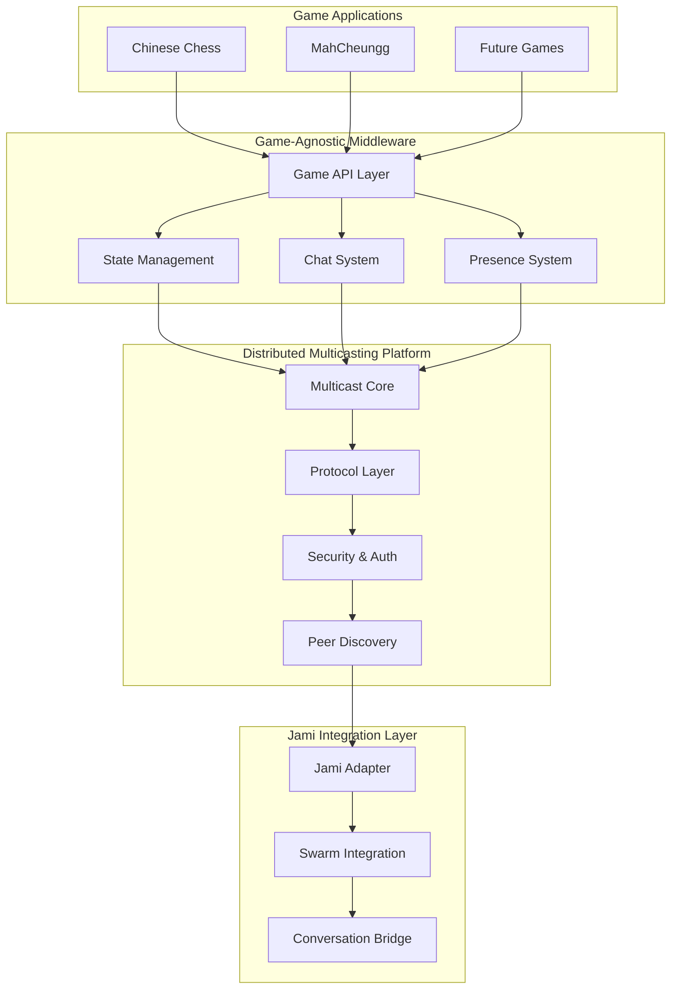

# Jami-Based Distributed Multicasting Architecture

**UUID: 7e9f2c5a-8b3d-4f1a-9c6e-d8a5e4b7c321**  
**Date: April 28, 2025**  
**Author: Robin's AI World**  
**Version: 1.0.0**

## 1. Overview

This document outlines the architecture for a modular, distributed multicasting system based on Jami's peer-to-peer technology. The architecture is designed to be:

1. **Game-agnostic** - Usable across multiple games and interactive applications
2. **LGPL-compliant** - Properly isolating the Jami components to comply with licensing requirements
3. **Low-latency** - Optimized for real-time game state synchronization
4. **Resilient** - Able to handle network disruptions and peer disconnections
5. **Extensible** - Designed as a potential B2B product offering

The system uses a layered approach that separates game-specific logic from the underlying communication infrastructure, allowing for maximum reusability across different projects.

## 2. System Architecture



## 3. Component Descriptions

### 3.1 Distributed Multicasting Platform

The core platform that will be developed as a separate B2B product offering:

#### 3.1.1 MulticastCore

Central engine that manages channels and coordinates between layers:

- Creates and manages communication channels
- Routes messages between components
- Handles channel lifecycle (creation, joining, leaving)
- Provides discovery mechanisms for available channels

#### 3.1.2 ProtocolLayer

Handles message formatting, serialization, and delivery:

- Defines message formats and serialization
- Implements reliable delivery mechanisms
- Handles message ordering and deduplication
- Provides congestion control and flow control

#### 3.1.3 SecurityLayer

Manages authentication, encryption, and access control:

- Verifies message authenticity
- Encrypts/decrypts messages
- Manages identity and credentials
- Implements access control policies

#### 3.1.4 PeerDiscovery

Responsible for finding and connecting to peers:

- Discovers available peers and channels
- Maintains peer connection state
- Handles NAT traversal
- Implements fallback mechanisms for connectivity

### 3.2 Jami Integration Layer

Adapts Jami functionality to work with the multicasting platform:

#### 3.2.1 JamiAdapter

Main interface to the Jami SDK:

- Loads and initializes the Jami SDK
- Provides factory methods for creating Jami-based components
- Handles LGPL compliance through dynamic loading
- Manages educational content about the Jami component

#### 3.2.2 SwarmIntegration

Integrates with Jami's swarm functionality:

- Creates and manages swarm instances
- Handles peer connections within swarms
- Provides message routing within swarms
- Manages swarm lifecycle

#### 3.2.3 ConversationBridge

Bridges to Jami's conversation functionality:

- Creates and manages conversations
- Handles message sending and receiving
- Manages conversation membership
- Provides conversation-specific features

### 3.3 Game-Agnostic Middleware

Provides game-specific functionality on top of the multicasting platform:

#### 3.3.1 GameAPI

Main API for games to interact with the platform:

- Creates and manages game sessions
- Provides access to subsystems (state, chat, presence)
- Handles session discovery and joining
- Manages session lifecycle

#### 3.3.2 StateManager

Manages game state synchronization:

- Maintains the current game state
- Handles state updates and synchronization
- Resolves conflicts in state updates
- Provides state change notifications

#### 3.3.3 ChatSystem

Manages in-game chat functionality:

- Sends and receives chat messages
- Handles message formatting and display
- Provides chat history
- Supports message types (text, emojis, etc.)

#### 3.3.4 PresenceSystem

Manages player presence information:

- Tracks player online/offline status
- Provides presence change notifications
- Handles player join/leave events
- Supports presence-related features (typing indicators, etc.)

## 4. Universal Handshake Protocol

A key feature of this architecture is the Universal Handshake Protocol, which enables different applications to identify and communicate with each other.

### 4.1 Handshake Message Structure

```typescript
interface HandshakeMessage {
  // Protocol identification
  protocol: {
    name: string;           // "RobinsAI.World-Multicast"
    version: string;        // Semantic versioning (e.g., "1.0.0")
    uuid: string;           // Protocol UUID for tracking
  };
  
  // Application identification
  application: {
    id: string;             // Application identifier (e.g., "ChineseChess", "MahCheungg")
    version: string;        // Application version
    type: string;           // Application type (e.g., "game", "chat", "utility")
  };
  
  // Session information
  session: {
    id: string;             // Unique session identifier
    mode: string;           // Session mode (e.g., "game", "chat", "mixed")
    visibility: string;     // "public", "private", "invite-only"
    created: number;        // Timestamp of creation
    creator: string;        // Creator identifier
  };
  
  // Capabilities and requirements
  capabilities: {
    features: string[];     // Supported features (e.g., "state-sync", "chat", "voice")
    dataFormats: string[];  // Supported data formats (e.g., "json", "binary", "protobuf")
    compression: string[];  // Supported compression methods
    encryption: string[];   // Supported encryption methods
  };
  
  // Data structure definitions
  dataStructures: {
    schemas: {              // JSON Schema definitions for data structures
      [key: string]: any;   // Key is the structure name, value is the schema
    };
    examples: {             // Example instances of data structures
      [key: string]: any;   // Key is the structure name, value is an example
    };
  };
  
  // Authentication (optional)
  auth?: {
    method: string;         // Authentication method
    publicKey?: string;     // Public key for verification
    token?: string;         // Authentication token
  };
}
```

### 4.2 Handshake Process

1. **Initiation**: When a client connects to a session, it immediately sends a handshake message.

2. **Capability Negotiation**: The receiving peer responds with its own handshake message, including its capabilities.

3. **Compatibility Check**: Both peers verify compatibility based on:
   - Protocol version compatibility
   - Required features support
   - Data format compatibility

4. **Feature Negotiation**: Peers determine the set of features and formats to use based on mutual capabilities.

5. **Schema Exchange**: Data structure schemas are exchanged and validated.

6. **Connection Establishment**: If all checks pass, the connection is established and normal communication begins.

7. **Fallback Mechanisms**: If incompatibilities are found, peers may negotiate fallback options or reject the connection.

### 4.3 Example Handshake (Chinese Chess)

```json
{
  "protocol": {
    "name": "RobinsAI.World-Multicast",
    "version": "1.0.0",
    "uuid": "7e9f2c5a-8b3d-4f1a-9c6e-d8a5e4b7c321"
  },
  "application": {
    "id": "GeneralXiangChineseChess",
    "version": "1.2.0",
    "type": "game"
  },
  "session": {
    "id": "game-28f9a1c5-6e7d-4b3a-9f8e-2d1c5b3a4f7d",
    "mode": "game",
    "visibility": "public",
    "created": 1714348800000,
    "creator": "player-1234"
  },
  "capabilities": {
    "features": ["state-sync", "chat", "presence", "moves", "history"],
    "dataFormats": ["json"],
    "compression": ["none", "gzip"],
    "encryption": ["aes-256-gcm"]
  },
  "dataStructures": {
    "schemas": {
      "GameState": {
        "type": "object",
        "properties": {
          "board": {
            "type": "array",
            "items": {
              "type": "array",
              "items": { "type": "string" }
            }
          },
          "currentTurn": {
            "type": "string",
            "enum": ["red", "black"]
          },
          "moveHistory": {
            "type": "array",
            "items": { "$ref": "#/schemas/Move" }
          },
          "stateVersion": { "type": "integer" },
          "lastMoveTimestamp": { "type": "integer" },
          "gameStatus": {
            "type": "string",
            "enum": ["waiting", "playing", "finished"]
          },
          "players": {
            "type": "object",
            "properties": {
              "red": { "type": "string" },
              "black": { "type": "string" }
            }
          }
        }
      },
      "Move": {
        "type": "object",
        "properties": {
          "from": { "type": "string" },
          "to": { "type": "string" },
          "piece": { "type": "string" },
          "captured": { "type": "string" }
        },
        "required": ["from", "to", "piece"]
      }
    },
    "examples": {
      "GameState": {
        "board": [
          ["R", "H", "E", "A", "G", "A", "E", "H", "R"],
          ["", "", "", "", "", "", "", "", ""],
          ["", "C", "", "", "", "", "", "C", ""],
          ["S", "", "S", "", "S", "", "S", "", "S"],
          ["", "", "", "", "", "", "", "", ""],
          ["", "", "", "", "", "", "", "", ""],
          ["s", "", "s", "", "s", "", "s", "", "s"],
          ["", "c", "", "", "", "", "", "c", ""],
          ["", "", "", "", "", "", "", "", ""],
          ["r", "h", "e", "a", "g", "a", "e", "h", "r"]
        ],
        "currentTurn": "red",
        "moveHistory": [],
        "stateVersion": 0,
        "lastMoveTimestamp": 1714348800000,
        "gameStatus": "waiting",
        "players": {
          "red": "Player 1",
          "black": null
        }
      },
      "Move": {
        "from": "a3",
        "to": "a4",
        "piece": "s"
      }
    }
  }
}
```

## 5. Implementation Strategy

### 5.1 LGPL Compliance Strategy

To comply with LGPL while keeping the Jami implementation separate:

1. **Separate Repository**: The Jami external component will be maintained in a separate repository.

2. **API-Based Integration**: All interaction with Jami will occur through a well-defined API.

3. **Dynamic Loading**: The Jami component will be loaded at runtime only when needed.

4. **User Notification**: Users will be informed about the download with educational content about decentralization and privacy benefits.

5. **Clear Separation**: The architecture will maintain a clear separation between LGPL and non-LGPL code.

### 5.2 Development Phases

1. **Phase 1: Core Infrastructure**
   - Develop the MulticastCore and basic protocol layer
   - Implement the JamiAdapter with minimal functionality
   - Create a simple test application to validate the architecture

2. **Phase 2: Game Integration**
   - Implement the GameAPI and related subsystems
   - Integrate with Chinese Chess as the first application
   - Develop comprehensive testing and monitoring

3. **Phase 3: Advanced Features**
   - Add security features and encryption
   - Implement advanced state synchronization
   - Develop administration and monitoring tools

4. **Phase 4: B2B Product Development**
   - Package the platform as a standalone product
   - Develop documentation and SDK
   - Create pricing and licensing models

### 5.3 Testing Strategy

1. **Unit Testing**: Test individual components in isolation.

2. **Integration Testing**: Test interactions between components.

3. **System Testing**: Test the entire system end-to-end.

4. **Performance Testing**: Measure latency, throughput, and resource usage.

5. **Stress Testing**: Test the system under high load and adverse conditions.

6. **Compatibility Testing**: Test with different client versions and configurations.

## 6. Conclusion

This architecture provides a flexible, modular foundation for building distributed multiplayer games and interactive applications. By leveraging Jami's peer-to-peer technology while maintaining LGPL compliance, we can create a powerful platform that eliminates the need for centralized servers, reducing costs and improving privacy.

The Universal Handshake Protocol ensures that different applications can communicate effectively, with clear identification of capabilities and data structures. This makes the platform highly extensible and adaptable to different use cases.

As a potential B2B product, this platform offers significant value to game developers and other interactive application creators who want to implement multiplayer features without the cost and complexity of maintaining server infrastructure.
