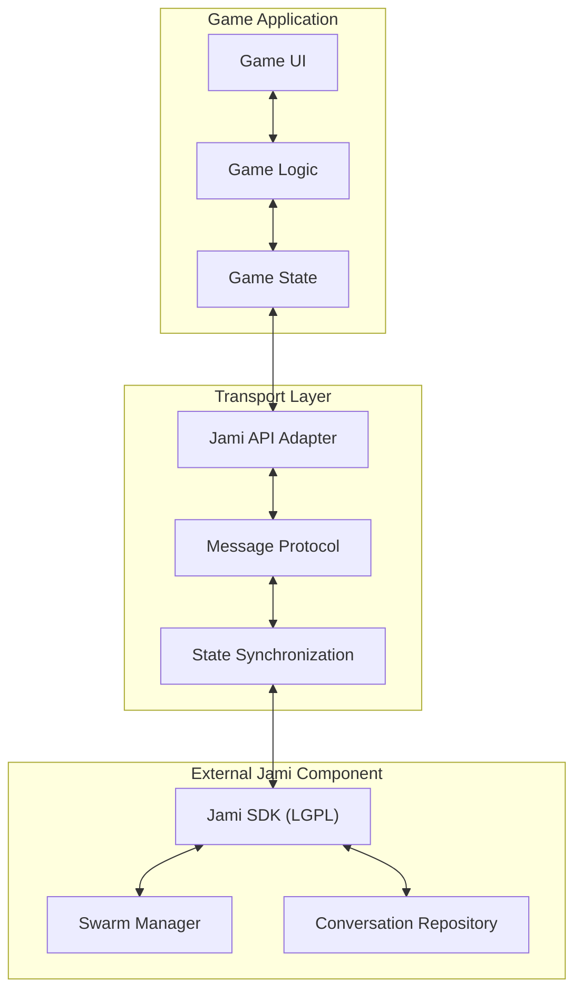

# Jami-Based Multiplayer Architecture Overview

**UUID: 7e9f2c5a-8b3d-4f1a-9c6e-d8a5e4b7c321**  
**Date: April 28, 2025**  
**Author: Robin's AI World**  
**Version: 1.0.0**

## 1. Overview

This document outlines the high-level architecture for implementing Jami as a multiplayer game state transport multicaster. The architecture is designed to be:

1. **LGPL-compliant** - Properly isolating the Jami components
2. **Low-latency** - Optimized for real-time game state synchronization
3. **Flexible** - Usable across different games and platforms
4. **Data structure-agnostic** - Using a preamble system for maximum flexibility

## 2. System Architecture

## 3. Key Components

### 3.1 External Jami Component (LGPL-Compliant)

This is a separate, downloadable component that handles all LGPL-licensed code:

- **Jami SDK**: Core Jami functionality
- **Swarm Manager**: Handles peer discovery and connection
- **Conversation Repository**: Manages message storage and retrieval

### 3.2 Transport Layer

This layer bridges the game with the external Jami component:

- **Jami API Adapter**: Interface to the Jami SDK
- **Message Protocol**: Defines message formats and handling
- **State Synchronization**: Ensures consistent game state across players

### 3.3 Game Application

The game-specific components:

- **Game UI**: User interface
- **Game Logic**: Game rules and mechanics
- **Game State**: Current state of the game

## 4. Implementation Strategy

The implementation will be divided into the following phases:

1. **Phase 1**: External Jami Component
   - Create a separate repository for LGPL code
   - Implement basic Jami SDK wrapper
   - Develop download and initialization mechanism

2. **Phase 2**: Transport Layer
   - Implement Jami API Adapter
   - Develop Message Protocol
   - Create State Synchronization system

3. **Phase 3**: Game Integration
   - Connect Game State to Transport Layer
   - Implement game-specific message handlers
   - Test and optimize performance

4. **Phase 4**: Platform Expansion
   - Extract core functionality into a separate product
   - Develop SDK for other games
   - Create documentation and examples

## 5. Next Steps

Detailed design documents will be created for each component, starting with:

1. [Universal Handshake Protocol](./PROTOCOL-UniversalHandshake-28apr2025.md)
2. [External Jami Component Design](./DESIGN-ExternalJamiComponent-28apr2025.md)
3. [Transport Layer Implementation](./IMPLEMENTATION-TransportLayer-28apr2025.md)
