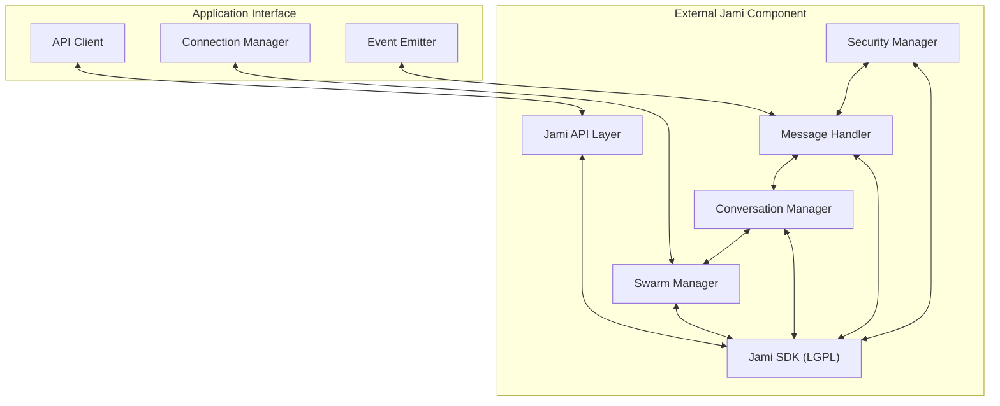

# External Jami Component Design

**UUID: 7e9f2c5a-8b3d-4f1a-9c6e-d8a5e4b7c321**  
**Date: April 28, 2025**  
**Author: Robin's AI World**  
**Version: 1.0.0**

## 1. Introduction

The External Jami Component is a separate, downloadable module that encapsulates all LGPL-licensed Jami code. This design ensures LGPL compliance while providing a clean API for game applications to interact with Jami's powerful distributed communication capabilities.

## 2. Design Goals

- **LGPL Compliance**: Properly isolate LGPL-licensed code
- **Clean API**: Provide a well-defined interface for applications
- **Performance**: Minimize overhead for real-time game communication
- **Flexibility**: Support various communication patterns
- **Educational**: Inform users about decentralization benefits

## 3. Component Architecture



## 4. Component Modules

### 4.1 Jami SDK

The core Jami functionality, including:

- DHT (Distributed Hash Table) for peer discovery
- Swarm protocol for group communication
- Conversation repository for message storage
- Security and encryption

### 4.2 Jami API Layer

The main interface for applications to interact with Jami:

```typescript
export interface JamiExternalInterface {
  // Initialization
  initialize(): Promise<boolean>;
  shutdown(): Promise<void>;
  
  // Account management
  createAccount(): Promise<string>;
  getAccountDetails(accountId: string): Promise<Record<string, string>>;
  
  // Conversation management
  createConversation(accountId: string): Promise<string>;
  joinConversation(accountId: string, conversationId: string): Promise<boolean>;
  leaveConversation(accountId: string, conversationId: string): Promise<boolean>;
  removeConversation(accountId: string, conversationId: string): Promise<boolean>;
  
  // Member management
  addConversationMember(accountId: string, conversationId: string, contactUri: string): Promise<boolean>;
  getConversationMembers(accountId: string, conversationId: string): Promise<string[]>;
  
  // Message handling
  sendMessage(accountId: string, conversationId: string, message: string, replyTo?: string): Promise<string>;
  loadConversationMessages(accountId: string, conversationId: string, fromMessage?: string, count?: number): Promise<any[]>;
  
  // Event callbacks
  onMessageReceived(callback: (accountId: string, conversationId: string, message: any) => void): void;
  onConversationReady(callback: (accountId: string, conversationId: string) => void): void;
  onMemberEvent(callback: (accountId: string, conversationId: string, member: string, event: number) => void): void;
}
```

### 4.3 Swarm Manager

Handles peer discovery and connection management:

- Creates and joins swarms
- Manages peer connections
- Handles network topology
- Provides fallback mechanisms for connectivity

### 4.4 Conversation Manager

Manages conversations and message storage:

- Creates and joins conversations
- Manages conversation membership
- Handles message storage and retrieval
- Provides conversation metadata

### 4.5 Message Handler

Processes incoming and outgoing messages:

- Serializes and deserializes messages
- Routes messages to appropriate handlers
- Implements reliability mechanisms
- Handles message ordering and deduplication

### 4.6 Security Manager

Handles security and encryption:

- Manages identity and credentials
- Encrypts and decrypts messages
- Verifies message authenticity
- Implements access control

## 5. Deployment Strategy

### 5.1 Packaging

The External Jami Component will be packaged as:

- A standalone executable for desktop platforms
- A dynamic library for mobile platforms
- A WebAssembly module for web platforms

### 5.2 Distribution

The component will be distributed through:

- A dedicated download server
- Application stores where applicable
- In-app download mechanism

### 5.3 Installation

The installation process will:

1. Check if the component is already installed
2. Present educational content about decentralization benefits
3. Download and install the component
4. Verify installation integrity
5. Initialize the component

### 5.4 Educational Content

The educational content will explain:

- The benefits of decentralized communication
- How peer-to-peer technology works
- Privacy advantages
- Cost savings from server-less architecture
- Open-source nature of the technology

## 6. API Usage Examples

### 6.1 Initialization

```typescript
// Initialize the Jami component
const jami = new JamiExternalComponent();
await jami.initialize();

// Create an account
const accountId = await jami.createAccount();
```

### 6.2 Creating a Conversation

```typescript
// Create a new conversation
const conversationId = await jami.createConversation(accountId);

// Set up message handler
jami.onMessageReceived((accountId, conversationId, message) => {
  console.log(`Received message in conversation ${conversationId}:`, message);
});
```

### 6.3 Sending Messages

```typescript
// Send a message
await jami.sendMessage(accountId, conversationId, JSON.stringify({
  type: 'GAME_STATE',
  state: gameState,
  timestamp: Date.now()
}));
```

### 6.4 Adding Members

```typescript
// Add a member to the conversation
await jami.addConversationMember(accountId, conversationId, memberUri);

// Set up member event handler
jami.onMemberEvent((accountId, conversationId, member, event) => {
  console.log(`Member ${member} event ${event} in conversation ${conversationId}`);
});
```

## 7. Performance Considerations

To ensure low latency for game state synchronization:

1. **Message Prioritization**: Prioritize game state messages over other types
2. **Batching**: Batch small updates when appropriate
3. **Compression**: Use compression for large state updates
4. **Delta Encoding**: Send only state changes when possible
5. **Prediction**: Implement client-side prediction to mask latency
6. **Bandwidth Management**: Adapt to available bandwidth
7. **Connection Quality Monitoring**: Monitor and adapt to connection quality

## 8. Security Considerations

The External Jami Component will implement several security measures:

1. **End-to-End Encryption**: All messages are encrypted
2. **Identity Verification**: Verify peer identities
3. **Access Control**: Control who can join conversations
4. **Message Authentication**: Verify message authenticity
5. **Secure Storage**: Securely store keys and credentials
6. **Privacy Protection**: Minimize data collection and sharing

## 9. LGPL Compliance

To ensure LGPL compliance:

1. **Separate Repository**: Maintain the component in a separate repository
2. **Clear Licensing**: Clearly indicate LGPL licensing
3. **Source Availability**: Make source code available
4. **Dynamic Linking**: Use dynamic linking where possible
5. **API Isolation**: Interact only through well-defined APIs
6. **Documentation**: Document compliance measures

## 10. Future Extensions

Potential future extensions include:

- **Voice and Video**: Support for real-time voice and video
- **File Transfer**: Optimized file transfer capabilities
- **Presence**: Enhanced presence information
- **Offline Messaging**: Support for offline message delivery
- **Multi-Device Sync**: Improved multi-device synchronization
- **Analytics**: Anonymous usage analytics for performance optimization

## 11. Conclusion

The External Jami Component design provides a robust foundation for implementing distributed multiplayer functionality while ensuring LGPL compliance. By encapsulating all Jami-related code in a separate component with a clean API, we can leverage Jami's powerful capabilities while maintaining flexibility and compliance with licensing requirements.
