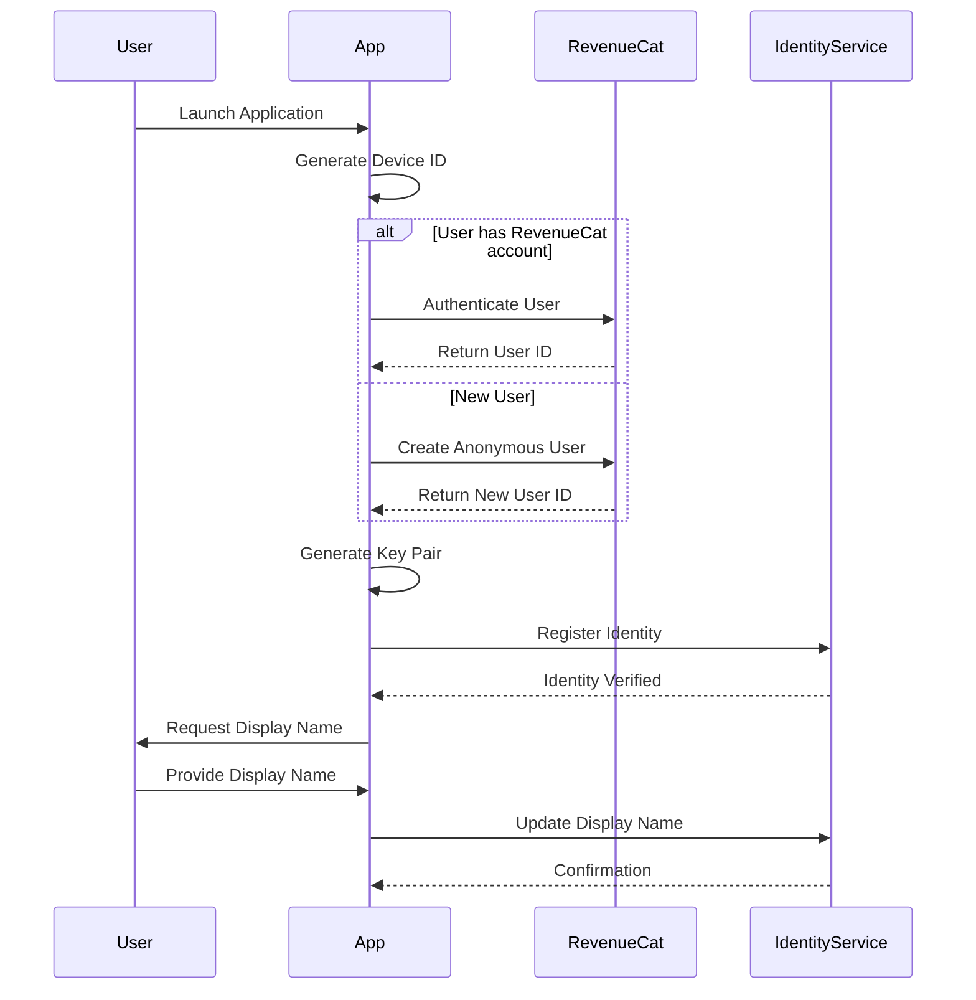

# User Identity Management

**UUID: 7e9f2c5a-8b3d-4f1a-9c6e-d8a5e4b7c321**  
**Date: April 28, 2025**  
**Author: Robin's AI World**  
**Version: 1.0.0**

## 1. Introduction

User Identity Management is a critical component of our distributed multiplayer architecture. It ensures that users can be uniquely identified across different games and platforms, enabling consistent experiences, proper attribution, and secure interactions. This document outlines our approach to managing user identities in a decentralized environment.

## 2. Identity Model

### 2.1 Multi-Layered Identity

Our identity model uses multiple identifiers to ensure uniqueness and flexibility:

```typescript
export interface UserIdentity {
  // Display information (not guaranteed to be unique)
  displayName: string;
  avatarUrl?: string;
  
  // Unique identifiers (guaranteed to be unique)
  uniqueId: string;       // RevenueCat/Stripe user ID
  platformId: string;     // Platform-specific ID
  deviceId: string;       // Device-specific identifier
  
  // Authentication
  publicKey: string;      // For message verification
  
  // Optional metadata
  metadata?: {
    [key: string]: any;   // Platform-specific metadata
  };
}
```

### 2.2 Identity Hierarchy

The identity system follows this hierarchy:

1. **RevenueCat/Stripe ID**: Primary unique identifier tied to payment system
   - Guaranteed unique across all platforms
   - Persistent across devices and installations
   - Used for premium feature entitlements

2. **Platform ID**: Secondary identifier specific to the platform
   - Unique within a specific platform (e.g., Google Play, App Store)
   - Used for platform-specific features

3. **Device ID**: Tertiary identifier specific to the device
   - Unique to a specific device installation
   - Used for device-specific settings and state

4. **Display Name**: User-facing identifier
   - Not guaranteed to be unique
   - Used for UI display and social features

## 3. Identity Creation and Verification

### 3.1 Identity Creation Flow



### 3.2 Identity Verification

To verify user identity, we use a multi-factor approach:

1. **RevenueCat/Stripe Verification**:
   - Verify user ID with RevenueCat/Stripe API
   - Check subscription status and entitlements

2. **Cryptographic Verification**:
   - Verify message signatures using public key
   - Challenge-response authentication for sensitive operations

3. **Device Verification**:
   - Verify device ID against registered devices
   - Detect and handle new devices

## 4. Identity Storage and Synchronization

### 4.1 Local Storage

User identity information is stored locally:

```typescript
interface LocalIdentityStore {
  currentIdentity: UserIdentity;
  knownIdentities: Map<string, UserIdentity>;  // uniqueId -> UserIdentity
  sessionTokens: Map<string, string>;          // sessionId -> token
  keyPairs: {
    publicKey: string;
    privateKey: string;
  };
}
```

### 4.2 Remote Storage

Identity information is also stored in:

1. **RevenueCat/Stripe**: Primary identity and subscription information
2. **Platform Services**: Platform-specific identity information
3. **Jami Metadata**: For sharing with other peers during gameplay

### 4.3 Synchronization

Identity information is synchronized:

1. **On Launch**: Synchronize with RevenueCat/Stripe
2. **On Network Change**: Verify and update as needed
3. **On Session Join**: Share with other session participants
4. **Periodically**: Regular background verification

## 5. Identity in Handshake Protocol

The Universal Handshake Protocol includes identity information:

```typescript
interface HandshakeMessage {
  // Protocol identification
  protocol: {
    name: string;
    version: string;
    uuid: string;
  };
  
  // Application identification
  application: {
    id: string;
    version: string;
    type: string;
  };
  
  // Session information
  session: {
    id: string;
    mode: string;
    created: number;
  };
  
  // User identity (enhanced with unique IDs)
  creator: {
    displayName: string;
    uniqueId: string;       // RevenueCat/Stripe user ID
    platformId: string;     // Platform-specific ID
    publicKey: string;      // For message verification
    signature: string;      // Signature of session ID with private key
  };
  
  // Rest of handshake message...
}
```

## 6. Identity Privacy and Security

### 6.1 Privacy Considerations

To protect user privacy:

1. **Minimal Sharing**: Only share necessary identity information
2. **Consent-Based**: Get user consent before sharing identity
3. **Revocable**: Allow users to revoke access to their identity
4. **Transparent**: Clearly communicate what is shared and why

### 6.2 Security Measures

To secure identity information:

1. **Encryption**: Encrypt identity information in transit and at rest
2. **Key Rotation**: Regularly rotate cryptographic keys
3. **Secure Storage**: Store sensitive information in secure storage
4. **Access Control**: Limit access to identity information

## 7. Cross-Platform Identity

### 7.1 Platform-Specific Considerations

Different platforms have different identity mechanisms:

1. **Mobile**: Use platform authentication (Apple ID, Google Sign-In)
2. **Desktop**: Use platform-specific identifiers
3. **Web**: Use browser-based authentication
4. **Console**: Use console-specific identity services

### 7.2 Identity Linking

Users can link identities across platforms:

1. **QR Code Linking**: Scan QR code to link devices
2. **Email Verification**: Verify email to link accounts
3. **RevenueCat/Stripe Linking**: Link through payment system
4. **Temporary Codes**: Use temporary codes for linking

## 8. Implementation Guidelines

When implementing the identity system:

1. **Fallback Mechanisms**: Implement fallbacks for when primary identification fails
2. **Graceful Degradation**: Continue with limited functionality when full identity verification is not possible
3. **Clear Error Messages**: Provide clear error messages for identity issues
4. **User Control**: Give users control over their identity information
5. **Audit Logging**: Log identity-related operations for security auditing

## 9. RevenueCat/Stripe Integration

### 9.1 RevenueCat Integration

RevenueCat provides:

1. **Unique User IDs**: Guaranteed unique across platforms
2. **Subscription Management**: Track user subscriptions
3. **Entitlement Verification**: Verify feature access
4. **Cross-Platform Sync**: Synchronize identity across platforms

### 9.2 Stripe Integration

For direct Stripe integration:

1. **Customer IDs**: Use Stripe Customer IDs as unique identifiers
2. **Payment Verification**: Verify payment status
3. **Subscription Management**: Track subscription status
4. **Webhook Integration**: Update identity on payment events

## 10. Future Extensions

Potential future extensions include:

1. **Federated Identity**: Support for third-party identity providers
2. **Biometric Verification**: Additional security through biometrics
3. **Reputation System**: User reputation tracking
4. **Social Graph**: Friend relationships and social features
5. **Credential Recovery**: Improved account recovery mechanisms

## 11. Conclusion

The User Identity Management system provides a robust foundation for uniquely identifying users across our platform. By using RevenueCat/Stripe user IDs as the primary unique identifier, we ensure that users can be consistently identified regardless of their display name or device, enabling secure and personalized experiences across all our games and applications.
