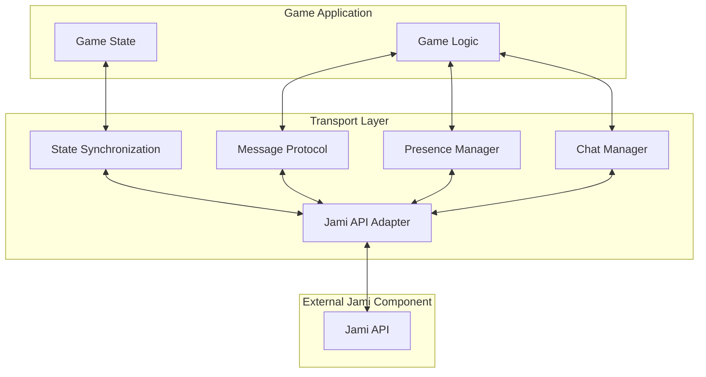
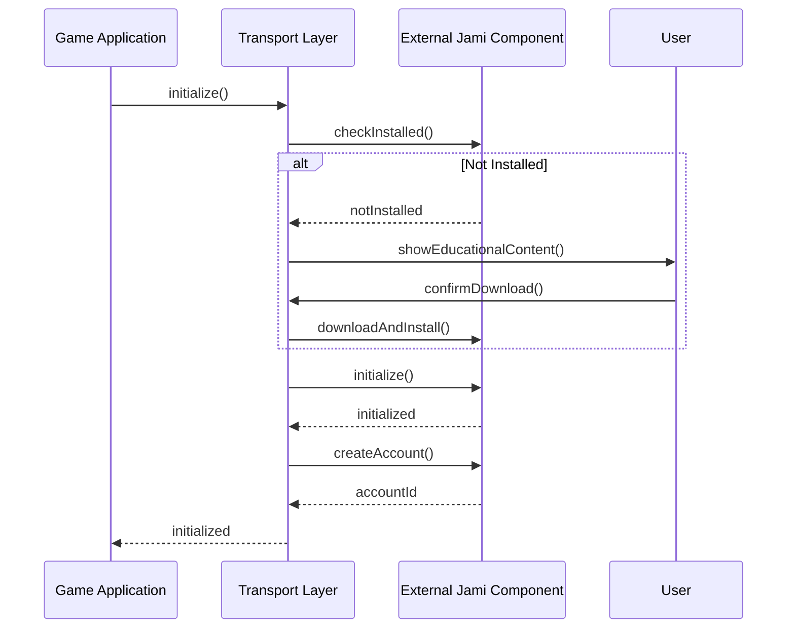
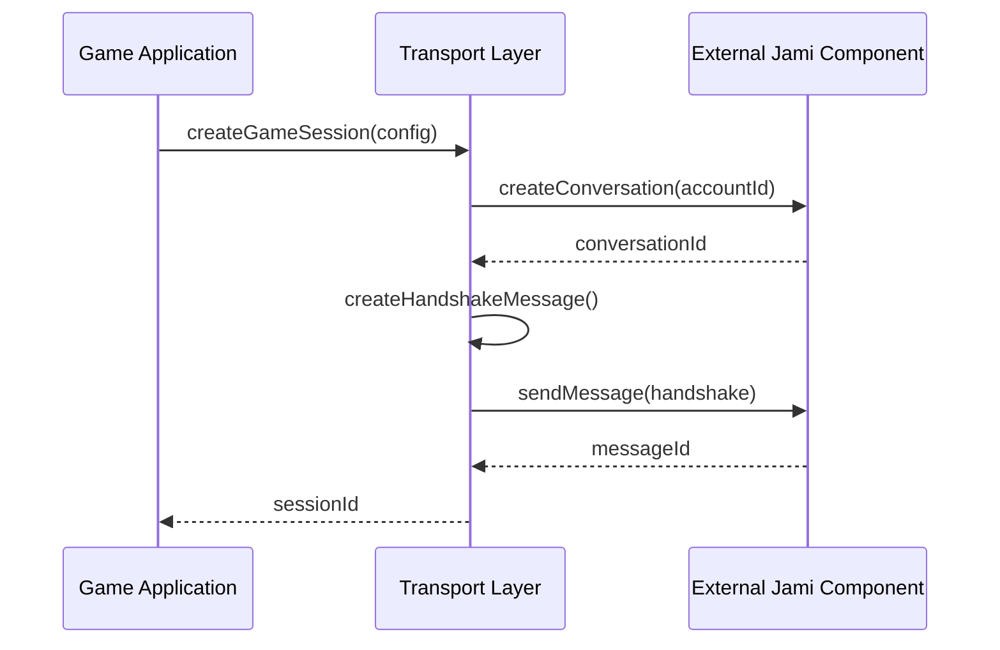
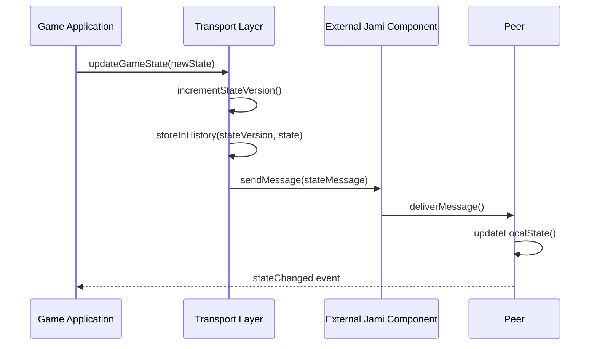

# Transport Layer Implementation

**UUID: 7e9f2c5a-8b3d-4f1a-9c6e-d8a5e4b7c321**  
**Date: April 28, 2025**  
**Author: Robin's AI World**  
**Version: 1.0.0**

## 1. Introduction

The Transport Layer serves as the bridge between game applications and the External Jami Component. It provides a game-friendly API for state synchronization, messaging, and presence management while handling the complexities of the underlying Jami communication.

## 2. Component Architecture



## 3. Key Components

### 3.1 Jami API Adapter

The Jami API Adapter is responsible for:

- Loading and initializing the External Jami Component
- Providing a simplified interface to Jami functionality
- Handling connection management
- Implementing error handling and recovery

```typescript
export class JamiTransportAdapter {
  private jamiExternal: JamiExternalInterface;
  private accountId: string;
  private conversationId: string | null = null;
  private protocol: GameStateProtocol | null = null;
  private playerId: string;
  private messageHandlers: Map<MessageType, Set<MessageHandler>> = new Map();
  private isInitialized = false;
  
  constructor(jamiExternal: JamiExternalInterface, playerId: string) {
    this.jamiExternal = jamiExternal;
    this.playerId = playerId;
  }
  
  async initialize(): Promise<boolean> {
    if (this.isInitialized) return true;
    
    const initialized = await this.jamiExternal.initialize();
    if (!initialized) return false;
    
    // Create or get account
    this.accountId = await this.jamiExternal.createAccount();
    
    // Set up message handler
    this.jamiExternal.onMessageReceived(this.handleMessageReceived.bind(this));
    this.jamiExternal.onConversationReady(this.handleConversationReady.bind(this));
    this.jamiExternal.onMemberEvent(this.handleMemberEvent.bind(this));
    
    this.isInitialized = true;
    return true;
  }
  
  // Additional methods for session management, messaging, etc.
}
```

### 3.2 Message Protocol

The Message Protocol defines the structure and handling of messages:

```typescript
export enum MessageType {
  HANDSHAKE = 'HANDSHAKE',
  GAME_STATE = 'GAME_STATE',
  MOVE = 'MOVE',
  CHAT = 'CHAT',
  PRESENCE = 'PRESENCE',
  SYNC_REQUEST = 'SYNC_REQUEST',
  SYNC_RESPONSE = 'SYNC_RESPONSE'
}

export interface BaseMessage {
  type: MessageType;
  senderId: string;
  senderUniqueId: string;  // RevenueCat/Stripe user ID for unique identification
  timestamp: number;
  vectorClock: VectorClock;
  sessionId: string;
}

export interface HandshakeMessage extends BaseMessage {
  type: MessageType.HANDSHAKE;
  config: GameSessionConfig;
  capabilities: string[];
  userIdentity: {
    displayName: string;
    uniqueId: string;     // RevenueCat/Stripe user ID
    platformId: string;   // Platform-specific ID
    avatarUrl?: string;   // Optional avatar URL
  };
}

// Additional message type interfaces...
```

### 3.3 State Synchronization

The State Synchronization component manages game state across peers:

```typescript
export class GameStateSynchronizer {
  private transport: JamiTransportAdapter;
  private gameState: any;
  private stateVersion: number = 0;
  private stateHistory: Map<number, any> = new Map();
  private stateChangeHandlers: Set<StateChangeHandler> = new Set();
  private conflictResolver: ConflictResolver;
  
  constructor(transport: JamiTransportAdapter, initialState: any, conflictResolver: ConflictResolver) {
    this.transport = transport;
    this.gameState = initialState;
    this.conflictResolver = conflictResolver;
    this.stateHistory.set(0, initialState);
    
    // Subscribe to state update messages
    this.transport.addMessageHandler(MessageType.GAME_STATE, this.handleStateUpdate.bind(this));
    this.transport.addMessageHandler(MessageType.SYNC_REQUEST, this.handleSyncRequest.bind(this));
    this.transport.addMessageHandler(MessageType.SYNC_RESPONSE, this.handleSyncResponse.bind(this));
  }
  
  // Methods for state management, synchronization, etc.
}
```

### 3.4 Presence Manager

The Presence Manager tracks player presence:

```typescript
export class PresenceManager {
  private transport: JamiTransportAdapter;
  private presenceMap: Map<string, PresenceInfo> = new Map();
  private presenceHandlers: Set<PresenceHandler> = new Set();
  
  constructor(transport: JamiTransportAdapter) {
    this.transport = transport;
    
    // Subscribe to presence messages
    this.transport.addMessageHandler(MessageType.PRESENCE, this.handlePresenceUpdate.bind(this));
  }
  
  // Methods for presence management
}
```

### 3.5 Chat Manager

The Chat Manager handles in-game chat:

```typescript
export class ChatManager {
  private transport: JamiTransportAdapter;
  private chatHistory: ChatMessage[] = [];
  private chatHandlers: Set<ChatHandler> = new Set();
  
  constructor(transport: JamiTransportAdapter) {
    this.transport = transport;
    
    // Subscribe to chat messages
    this.transport.addMessageHandler(MessageType.CHAT, this.handleChatMessage.bind(this));
  }
  
  // Methods for chat management
}
```

## 4. User Identity Management

### 4.1 Unique User Identification

To ensure unique user identification across the platform, we use a multi-layered approach:

```typescript
export interface UserIdentity {
  // Display name (not guaranteed to be unique)
  displayName: string;
  
  // Guaranteed unique identifiers
  uniqueId: string;       // RevenueCat/Stripe user ID
  platformId: string;     // Platform-specific ID (e.g., device ID)
  
  // Optional fields
  avatarUrl?: string;     // User avatar
  publicKey?: string;     // For message verification
}
```

### 4.2 Identity Verification

The system verifies user identity through:

1. **RevenueCat/Stripe ID**: Primary unique identifier tied to payment system
2. **Platform ID**: Secondary identifier specific to the platform
3. **Public Key**: For cryptographic verification of messages
4. **Session Token**: For temporary session authentication

### 4.3 Identity Storage

User identities are stored in:

1. **Local Storage**: For quick access during gameplay
2. **Jami Metadata**: For sharing with other peers
3. **Backend Verification**: For validating premium features

## 5. Implementation Details

### 5.1 Initialization Flow



### 5.2 Game Session Creation



### 5.3 State Synchronization



## 6. Error Handling and Recovery

### 6.1 Connection Issues

The Transport Layer implements several strategies for handling connection issues:

1. **Automatic Reconnection**: Attempts to reconnect when connection is lost
2. **State Caching**: Caches state updates for resending after reconnection
3. **Peer Fallback**: Falls back to alternative peers if primary peer is unreachable
4. **Graceful Degradation**: Continues with reduced functionality when full connectivity is not available

### 6.2 State Conflicts

State conflicts are resolved through:

1. **Vector Clocks**: Track causality between state updates
2. **Last-Writer-Wins**: Simple conflict resolution strategy
3. **Custom Resolvers**: Game-specific conflict resolution logic
4. **State Merging**: Intelligent merging of conflicting states

### 6.3 Error Reporting

Errors are reported through:

1. **Error Events**: Emitted to the game application
2. **Logging**: Detailed logging for debugging
3. **Telemetry**: Anonymous error reporting for improving the system

## 7. Performance Optimization

### 7.1 Message Compression

Messages are compressed using:

1. **Delta Encoding**: Only sending state changes
2. **Binary Serialization**: More efficient than JSON for large states
3. **Compression Algorithms**: GZIP or LZ4 for further size reduction

### 7.2 Bandwidth Management

Bandwidth is managed through:

1. **Priority Queuing**: Critical messages sent first
2. **Rate Limiting**: Preventing bandwidth saturation
3. **Adaptive Quality**: Adjusting detail level based on bandwidth
4. **Background Synchronization**: Non-critical updates sent during idle time

### 7.3 Latency Reduction

Latency is reduced through:

1. **Prediction**: Client-side prediction of game state
2. **Interpolation**: Smooth transitions between states
3. **Direct Connections**: Peer-to-peer connections when possible
4. **Optimistic Updates**: Applying local changes before confirmation

## 8. Security Considerations

### 8.1 Message Authentication

All messages are authenticated using:

1. **Digital Signatures**: Verify message sender
2. **Message IDs**: Prevent replay attacks
3. **Timestamps**: Verify message freshness

### 8.2 Access Control

Access to game sessions is controlled through:

1. **Invitation System**: Explicit invitations to join
2. **Session Tokens**: Temporary access tokens
3. **Capability-Based Security**: Granular permission control

### 8.3 Privacy Protection

User privacy is protected through:

1. **Minimal Data Collection**: Only collecting necessary data
2. **End-to-End Encryption**: Preventing eavesdropping
3. **Data Minimization**: Not sharing unnecessary information with peers

## 9. Testing Strategy

The Transport Layer will be tested through:

1. **Unit Tests**: Testing individual components
2. **Integration Tests**: Testing component interactions
3. **Simulation Tests**: Simulating network conditions
4. **Load Tests**: Testing under high load
5. **Compatibility Tests**: Testing with different game implementations

## 10. Conclusion

The Transport Layer provides a robust foundation for implementing multiplayer functionality in games using Jami's distributed communication capabilities. By handling the complexities of peer-to-peer communication, state synchronization, and user identity management, it allows game developers to focus on game-specific logic while benefiting from a server-less architecture.
